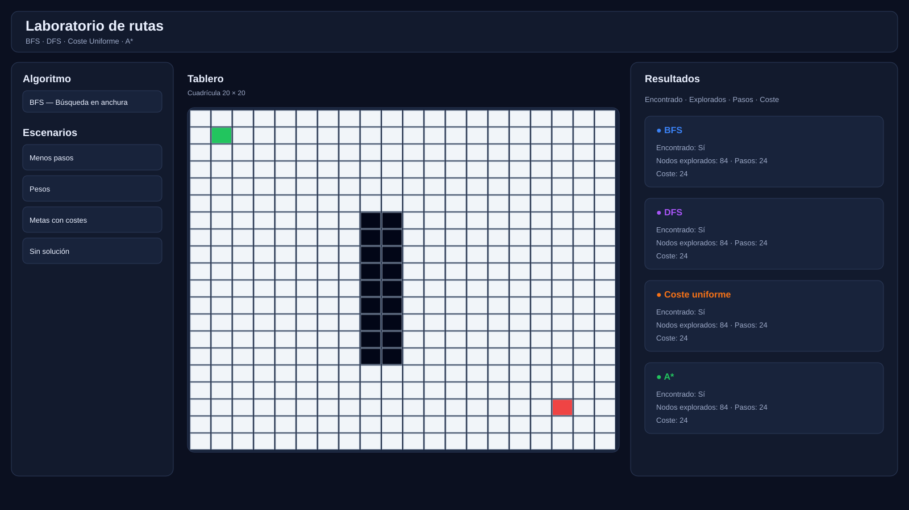
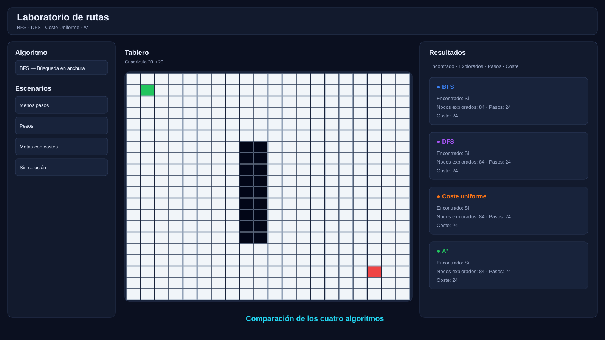

#  Laboratorio de rutas — Algoritmos de búsqueda

## 1.  Objetivo

El objetivo del proyecto es entender y saber comparar 4 de los algoritmos que existen para poder aprender a tomar buenas decisiones en nuestros proyectos.

La aplicación nos muestra:

- cómo explora cada algoritmo el tablero;
- qué camino encuentra;
- cuántos nodos explora;
- cuántos pasos necesita;
- qué coste obtiene;
- cómo afectan los pesos de las celdas;
- cómo afectan los costes asociados a las metas;
- y cómo cambia el comportamiento cuando no existe solución.


---

## 2.  Tecnologías utilizadas

- **HTML5** — estructura de la interfaz.
- **CSS3** — diseño visual, tablero, colores, iconos y diseño responsive.
- **JavaScript ES6+** — lógica de la aplicación, interacción, animaciones y algoritmos.
- **DOM API** — creación y actualización dinámica del tablero y resultados.
- **CSS Grid** — construcción de la cuadrícula 20 × 20.
- **Sin dependencias externas** — el proyecto funciona directamente en un navegador moderno.

### Estructura

```text
proyecto/
├── index.html
├── style.css
├── app.js
├── algorithms.js
├── README.md
└── capturas/
    ├── interfaz-principal.svg
    ├── escenario-metas.svg
    └── comparacion.svg
```

---

## 3. ▶ Instrucciones de uso

### Opción A — Abrir directamente

1. Descarga o descomprime el proyecto.
2. Abre `index.html` con Chrome, Edge o Firefox.
3. No es necesario instalar ninguna librería.

### Opción B — Visual Studio Code

1. Abre la carpeta del proyecto en Visual Studio Code.
2. Abre `index.html`.
3. Ejecuta el archivo con un servidor local, por ejemplo mediante Live Server.

### Flujo básico

1. Selecciona un algoritmo.
2. Configura el tablero manualmente o utiliza uno de los escenarios.
3. Pulsa **Ejecutar**.
4. Utiliza **Pausar / Continuar** para controlar la animación.
5. Activa o desactiva **Mostrar exploración** según quieras visualizar las celdas por las que pasa.
6. Pulsa **Comparar todas** para ejecutar los cuatro algoritmos.
7. Consulta los resultados individuales en la columna derecha y la tabla comparativa que está debajo del tablero.

---

## 4.  Elementos de la interfaz

### Barra superior

-  **Velocidad de animación**: modifica la velocidad a la que se ejecuta el algoritmo
-  **Mostrar exploración**: muestra u oculta los nodos explorados.
-  **Ejecutar**: ejecuta el algoritmo seleccionado.
-  **Comparar todas**: calcula y visualiza BFS, DFS, Coste Uniforme y A*.
-  **Pausar / Continuar**: detiene o continúa la animación.
-  **Aleatorio**: genera un tablero con inicio, metas, obstáculos y pesos aleatorios.
-  **Limpiar**: reinicia el tablero, incluso si la animación está pausada.

### Panel izquierdo

Permite seleccionar:

- Algoritmo.
- Escenario.
- Herramienta de dibujo.
- Peso de celda.
- Coste de meta.
- Número de metas aleatorias.
- Meta activa cuando existen varias metas.

### Herramientas de dibujo

-  **Obstáculo**: impide el paso del algoritmo.
-  **Borrar**: elimina obstáculos, pesos o metas.
-  **Inicio**: coloca o mueve el punto de partida.
-  **Meta**: añade una meta.
-  **Peso**: asigna un coste de entrada a una celda.

---

## 5.  Descripción de los algoritmos

###  BFS — Breadth-First Search

**Búsqueda en anchura.**

Explora primero los nodos que están a menor número de pasos del inicio. Utiliza una cola.

- Garantiza el camino con menos pasos cuando todas las acciones tienen el mismo coste.
- No utiliza pesos de las celdas para decidir el camino.
- No utiliza heurística.

**Idea:** explora por niveles: primero los vecinos del inicio, después los vecinos de esos vecinos, etc.

---

###  DFS — Depth-First Search

**Búsqueda en profundidad.**

Avanza por una rama todo lo posible antes de retroceder. Utiliza una pila.

- Puede encontrar una solución rápidamente dependiendo de la estructura del tablero.
- No garantiza el camino de menor número de pasos.
- No utiliza los pesos como criterio de decisión.
- No utiliza heurística.

**Idea:** profundiza por un camino y vuelve atrás cuando ya no puede continuar.

---

###  Coste Uniforme — Uniform Cost Search

Selecciona para expandir el nodo cuyo camino acumulado tiene menor coste.

- Tiene en cuenta los pesos de las celdas.
- Permite encontrar el camino de menor coste cuando los costes son no negativos.
- No utiliza heurística.
- También incorpora el coste de la meta al calcular el coste final.

**Idea:** no busca necesariamente el camino con menos pasos, sino el camino con menor coste total.

---

###  A* — A-Star

Combina el coste acumulado con una estimación de la distancia restante.

Utiliza:

```text
f(n) = g(n) + h(n)
```

Donde:

- `g(n)` = coste acumulado desde el inicio.
- `h(n)` = estimación del coste restante.
- `f(n)` = prioridad utilizada para seleccionar el siguiente nodo.

En este proyecto se utiliza la **distancia Manhattan** como heurística.

- Tiene en cuenta los pesos.
- Utiliza una heurística.
- Puede encontrar caminos de coste óptimo cuando la heurística es adecuada y se cumplen las condiciones de coste.

---

## 6.  Los cuatro escenarios

### 1. Menos pasos

Tablero limpio con inicio y una meta.

Sirve para observar el comportamiento básico de los algoritmos en un entorno sin obstáculos ni pesos.

### 2. Pesos

Incluye una zona de celdas con costes elevados.

Permite observar la diferencia entre algoritmos que buscan principalmente por pasos y algoritmos que consideran el coste.

### 3. Metas con costes

Incluye varias metas con costes diferentes.

Una meta físicamente más cercana puede tener un coste mayor que otra más alejada.

La aplicación permite seleccionar la **meta activa** y comparar los algoritmos respecto a ella.

### 4. Sin solución

Se crea una barrera que separa el inicio y la meta.

Sirve para comprobar cómo los cuatro algoritmos detectan que no existe un camino válido.

---

## 7.  Resultados y comparación

La aplicación muestra resultados individuales en una **columna situada a la derecha del tablero**.

Al pulsar **Comparar todas**, aparece debajo del tablero una tabla con los cuatro algoritmos.

La tabla incluye:

| Característica | Descripción |
|---|---|
| Algoritmo | BFS, DFS, Coste Uniforme o A* |
| Tipo de búsqueda | Anchura, profundidad, coste mínimo o coste + heurística |
| Pesos | Indica si el algoritmo utiliza los pesos |
| Heurística | Indica si utiliza una heurística |
| Encontrado | Si existe un camino hasta la meta |
| Nodos explorados | Número de nodos visitados durante la búsqueda |
| Pasos | Número de movimientos del camino encontrado |
| Coste | Coste total del camino |

### Actualización dinámica

La tabla se recalcula cuando cambia el estado relevante del tablero, por ejemplo:

- obstáculos;
- pesos;
- inicio;
- metas;
- coste de las metas;
- meta activa;
- escenarios;
- tablero aleatorio;
- limpieza del tablero.

De esta forma, la comparación siempre representa el **estado actual del tablero**.

---

## 8.  Pruebas realizadas

### Prueba 1 — Tablero sin obstáculos

**Objetivo:** comprobar que los cuatro algoritmos pueden encontrar una meta en un tablero libre.

**Resultado esperado:** los algoritmos deben encontrar un camino y mostrar sus métricas.

### Prueba 2 — Obstáculos

**Objetivo:** comprobar que ningún algoritmo atraviesa las celdas marcadas como obstáculos.

**Resultado esperado:** los caminos encontrados rodean los obstáculos.

### Prueba 3 — Pesos

**Objetivo:** comprobar que Coste Uniforme y A* tienen en cuenta el coste de las celdas.

**Resultado esperado:** pueden elegir un camino con más pasos si su coste total es menor.

### Prueba 4 — Varias metas

**Objetivo:** comprobar la selección de la meta activa y el coste asociado a cada meta.

**Resultado esperado:** la comparación cambia cuando se selecciona otra meta.

### Prueba 5 — Sin solución

**Objetivo:** comprobar el comportamiento cuando la meta está aislada.

**Resultado esperado:** `Encontrado = No`, pasos y coste aparecen como `—`.

### Prueba 6 — Pausa y limpieza

**Objetivo:** comprobar que la animación puede pausarse y que **Limpiar** sigue funcionando durante la pausa.

**Resultado esperado:** el tablero vuelve a quedar preparado para una nueva ejecución.

### Prueba 7 — Comparación dinámica

**Objetivo:** comprobar que la tabla comparativa representa siempre el tablero actual.

**Resultado esperado:** al modificar obstáculos, pesos, metas, inicio o costes, los resultados se recalculan.

---

## 9.  Capturas

### Interfaz principal



Vista general del laboratorio con el panel de configuración, tablero y columna de resultados.

### Escenario con varias metas


Ejemplo de tablero con varias metas y selección de meta activa.

### Comparación de algoritmos



Tabla comparativa situada debajo del tablero con las características y resultados de los cuatro algoritmos.

---

## 10.  Limitaciones

- El tablero utiliza movimientos en cuatro direcciones: arriba, derecha, abajo e izquierda.
- La heurística de A* es distancia Manhattan.
- Los costes de las celdas son positivos.
- BFS y DFS no utilizan los pesos como criterio de búsqueda; sus métricas de coste representan el número de movimientos.
- Coste Uniforme y A* sí consideran los pesos de entrada de las celdas y el coste adicional de la meta.
- La generación aleatoria puede producir tableros sin solución; esto también sirve para observar el comportamiento de los algoritmos ante un problema sin camino.
- La aplicación está pensada principalmente para fines educativos y visualización, no para medir rendimiento de algoritmos a gran escala.

---

## 11.  Enlaces de referencia

- MDN — HTML: https://developer.mozilla.org/es/docs/Web/HTML
- MDN — CSS: https://developer.mozilla.org/es/docs/Web/CSS
- MDN — JavaScript: https://developer.mozilla.org/es/docs/Web/JavaScript
- Wikipedia — Breadth-first search: https://en.wikipedia.org/wiki/Breadth-first_search
- Wikipedia — Depth-first search: https://en.wikipedia.org/wiki/Depth-first_search
- Wikipedia — Dijkstra's algorithm: https://en.wikipedia.org/wiki/Dijkstra%27s_algorithm
- Wikipedia — A* search algorithm: https://en.wikipedia.org/wiki/A*_search_algorithm

---

## 12.  Archivos principales

### `index.html`

Contiene la estructura de la interfaz: barra superior, panel de configuración, tablero, resultados y tabla comparativa.

### `style.css`

Contiene el diseño visual, colores, iconos, cuadrícula, tarjetas, tabla y comportamiento responsive.

### `app.js`

Gestiona la interacción con el usuario, creación del tablero, escenarios, herramientas de dibujo, animaciones, pausa, comparación y actualización dinámica de resultados.

### `algorithms.js`

Contiene las implementaciones de:

- BFS
- DFS
- Coste Uniforme
- A*

---

## ‍ Autora

**Maitane Herrera**

Proyecto académico — Sistemas de resolución de problemas por búsqueda.
